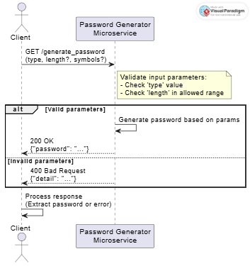

# Microservice A: Password Generator

This microservice generates secure passwords of various types:
`PIN`, `Medium`, `Strong`, and `Custom`. It is built using FastAPI
and designed to be integrated by using local HTTP requests.

## How to Programmatically Request Data

By default, this is the URL when FASTAPI runs on your machine.
To request a password, make a GET request to:
http://localhost:8000/generate_password

### Query Parameters:

| Parameter | Type    | Required | Description                                                      |
|-----------|---------|----------|------------------------------------------------------------------|
| `type`    | string  | Yes      | Password type: `PIN`, `Medium`, `Strong`, or `Custom`            |
| `length`  | int     | No       | Desired password length (must follow limits per type, see below) |
| `symbols` | boolean | No       | Use symbols in password (for `Strong` and `Custom` types only)   |

### Length Rules per Type

| Type    | Default Length | Allowed Range |
|---------|----------------|---------------|
| PIN     | 4              | 4–6           |
| Medium  | 8              | 6–12          |
| Strong  | 12             | 8–20          |
| Custom  | 12             | 1–64          |

## Example: Sending a Request

import requests

params = {
    "type": "Strong",
    "length": 16,
    "symbols": True
}

response = requests.get("http://localhost:8000/generate_password", params=params)

print("Status Code:", response.status_code)
print("Response:", response.json())

## Example: Receiving Data

data = response.json()
print("Your password is:", data.get("password", "No password returned"))

# Valid response
{
  "password": "A9b!Xy2#Wd34"
}

# Invalid response
{
  "detail": "Length for type 'PIN' must be between 4 and 6"
}

## Local Setup and Testing Instructions

1. Clone the repository
git clone https://github.com/demmerss34/Microservice-A-Password-Generator.git
cd Microservice-A-Password-Generator

2. Install dependencies 
pip install fastapi uvicorn httpx

3. Run the server
uvicorn password_generator_microservice:app --reload

4. Send a request (via Browser or Python)
Example browser URL:
http://localhost:8000/generate_password?type=Custom&length=10&symbols=true

## UML Sequence Diagram

## Author 

Stephan Demmers
Github: demmerss34
Email: demmerss@oregonstate.edu

